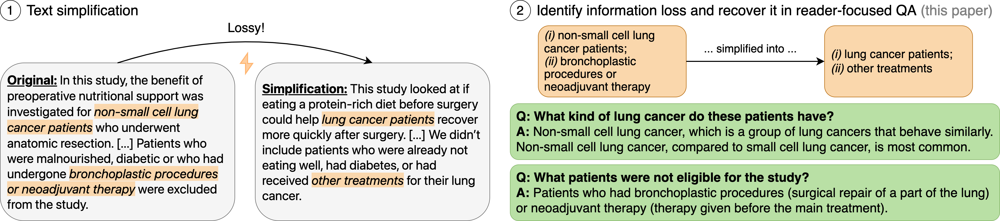

# InfoLossQA: Characterizing and Recovering Information Loss in Text Simplification

Text simplification aims to make technical texts more accessible to laypeople. However, even in professional simplifications this process often results in deletion of information and vagueness. This project proposes InfoLossQA, a framework to characterize and recover simplification-induced information loss in form of question-and-answer (QA) pairs.

**More information:** [Paper](https://arxiv.org/abs/2401.16475) | [Project Website](https://InfoLossQA.ikim.nrw/)

**Authors:** [Jan Trienes](https://jantrienes.com/), [Sebastian Joseph](https://www.linkedin.com/in/sebastian-joseph-a30228171/), [Jörg Schlötterer](https://www.bwl.uni-mannheim.de/strohmaier/team/wissenschaftliche-mitarbeiter/joerg-schloetterer/), [Christin Seifert](http://christinseifert.info/), [Kyle Lo](https://kyleclo.github.io/), [Wei Xu](https://cocoxu.github.io/), [Byron C. Wallace](https://www.byronwallace.com/), and [Junyi Jessy Li](https://jessyli.com/).



## Dataset

Original and simplified documents are in [`data/infolossqa-v1.0/documents.json`](data/infolossqa-v1.0).

<details>
<summary>Example</summary>

```json
{
  "PMCID": 1618957,
  "title": "Efficacy of lanreotide Autogel® administered every 4–8 weeks in patients with acromegaly previously responsive to lanreotide microparticles 30 mg: a phase III trial",
  "abstract": "OBJECTIVE AND DESIGN.\nDepot somatostatin analogues are well accepted as either adjuvant or primary therapy for acromegaly, and their long dosage intervals facilitate adherence to treatment. Our objective was to evaluate whether lanreotide Autogel® 120 mg, every 4–8 weeks, was as effective in controlling acromegaly as lanreotide microparticles 30 mg, every 1–2 weeks.\n\nPATIENTS DESIGN AND MEASUREMENTS.\nPatients who had used lanreotide microparticles 30 mg, ≥ 2 months prestudy, and had responded to treatment were recruited to this open, prospective, multicentre phase III trial. Three to five injections of lanreotide Autogel® 120 mg were administered. Lanreotide Autogel® 120 mg was injected every 4, 6 or 8 weeks in patients previously receiving lanreotide microparticles every 7, 10 or 14 days, respectively. GH and insulin-like growth factor (IGF)-1 levels were assessed one dosing interval after the final injections.\n\nRESULTS.\nNinety-eight patients were enrolled and 93 completed. Steady-state GH concentrations demonstrated similar efficacy between the formulations (upper 95% confidence interval of the quotient, 77·7%). Mean (SE) GH levels were lower with lanreotide Autogel® than with lanreotide microparticles (3·8 (0·5) vs 4·3 (0·5) ng/ml; P < 0·001). GH levels < 2·5 ng/ml were observed in 54% and 46% of patients; 40% and 35% having GH < 2·5 ng/ml and normalized IGF-1 with lanreotide Autogel® and microparticles, respectively. Symptoms were controlled better with lanreotide Autogel® and treatment was well accepted.\n\nCONCLUSIONS.\nLanreotide Autogel® 120 mg every 4–8 weeks, is at least as effective and as well tolerated in acromegaly as lanreotide microparticles 30 mg injected every 7–14 days.",
  "simplification": "GOAL AND PLAN\nThe goal of this study was to see if giving lanreotide Autogel® 120 mg every 4 to 8 weeks worked as well as giving lanreotide microparticles 30 mg every week or two for treating acromegaly, a condition that makes the body produce too much growth hormone. Giving medicine less often could make it easier for people to stick with treatment.\n\nSTUDY DESIGN AND WHAT WE MEASURED.\nWe asked people to join this study if they had been using lanreotide microparticles 30 mg in the past, and it had worked for them. We gave the patients 3 to 5 shots of lanreotide Autogel® 120 mg. If they had been getting lanreotide microparticles each week before the study, we gave them lanreotide autogel® every 4 weeks. We adjusted the timing based on how often they were getting their old medication. We checked their growth hormone and insulin-like growth factor-1 levels after their last shots.\n\nWHAT WE FOUND.\nNinety-eight patients joined the study and 93 finished it. The amount of growth hormone in their bodies showed that both formulas worked about the same. On average, the growth hormone levels were slightly lower with the Autogel® than the microparticles. Symptoms were better controlled with the Autogel® and patients were happy with the treatment.\n\nCONCLUSIONS.\nUsing lanreotide Autogel® 120 mg every 4 to 8 weeks works just as well and is as well tolerated as using lanreotide microparticles 30 mg every one to two weeks in treating acromegaly.",
  "sectioned": true
}
```

</details>


1,000 manually annotated information loss instances (QA pairs) are in [`data/infolossqa-v1.0/questions.json`](data/infolossqa-v1.0). Use the `PMCID` column to link questions to documents.

<details>
<summary>Example</summary>

```json
{
  "PMCID": 1618957,
  "edit_id": "687f678b397f413b5b4b00e3baf16f75",
  "category": "concept",
  "question": "How long had participants been taking 30mg of lanreotide before this study?",
  "answer": "All participants had been taking 30mg of lanreotide for a minimum of two months before this study.",
  "input_idx": [
    [
      417,
      479
    ]
  ],
  "output_idx": [
    [
      432,
      491
    ]
  ],
  "annotator": "kathryn"
}
```

**Legend**
- `PMCID`: The document ID, a valid PubMed Central identifier.
- `edit_id`: A unique identifier for the generated QA
- `category`: Type of information loss. In the paper we used a slightly different terminology. omission = Deletion, concept = Oversimplification.
- `question`: Question
- `answer`: Answer
- `input_idx`: Evidence span(s) in the source/original text
- `output_idx`: Rationale span(s) in the target/simplified text
- `annotator`: Identifier of the annotator (3 in total)

</details>


## Model Predictions

Model predictions can be found in [`data/infolossqa-v1.0/models/`](data/infolossqa-v1.0/models/).


<details>
<summary>Example</summary>

```json
{
  "PMCID": 1174877,
  "edit_id": "90ce92b51ab47919ff97c7cbbce3cf8f",
  "category": "concept",
  "question": "What is a unique characteristic of Telmisartan besides its ability to lower high blood pressure?",
  "answer": "Telmisartan is an antihypertensive agent with evidence of partial peroxisome proliferator-activated receptor activity-gamma (PPARγ) activity. This means it may have the ability to improve insulin sensitivity and lipid profile in patients with metabolic syndrome.",
  "input_idx": [
    [
      269,
      407
    ]
  ],
  "output_idx": [
    [
      374,
      436
    ]
  ],
  "annotator": "gpt-4",
  "prediction_errors": []
}
```

**Legend:**
- `prediction_errors`: Some LLM responses are erroneous. This field indicates errors (cf. Paper Table A.3).
- _For other fields, see above._

</details>


## Experiment Code

We provide sources to reproduce the experiments. API-based LLM responses were cached in `output/` so that the results should be stable. If you want to generate any outputs from scratch, remove the respective files from the cache.

### Setup

Use this Python environment:

```sh
conda env update -f environment.yml
conda activate ts-info-loss

pip install -r requirements-dev.txt
pip install -e .
```

Add your API keys to `.env` (see [`.env.template`](.env.template)).


### Generate Simplifications

At the time of this writing, GPT-4 API takes about 20 secs/doc (~1h for 200 docs).

```sh
python -m info_loss.preprocessing
```

### Running Models

End-to-end pipeline

```sh
# Mistral-7B (requires 1 GPU)
python -m info_loss.e2e --input_json data/processed/documents.json --output_path output/mistral-7b-instruct-one-shot/ --model mistral

# LLama2-70B (requires Together.ai API Key)
python -m info_loss.e2e --input_json data/processed/documents.json --output_path output/llama2-70b-chat-one-shot/ --model llama

# GPT-4 (requires OpenAI API Key)
python -m info_loss.e2e --input_json data/processed/documents.json --output_path output/gpt-4-0613-one-shot/ --model gpt4

# NLI Pipeline (requires OpenAI API Key)
python -m info_loss.gpt4_fact_extraction
```

### Classify Question Types

To classify questions according to the taxonomy of [Cao and Wang (2021)](https://aclanthology.org/2021.acl-long.502/).

```sh
python -m info_loss.gpt4_classify_questions --input_path <path/to/predictions.json> --output_json <path/to/questions.json>
```

### Automatic evaluation

```sh
# GPT-4o
python -m info_loss.evaluation.evaluate_all --input_json data/infolossqa-v1.0/evals-accuracy/samples.json --output_path output/gpt-eval/gpt-4o-2024-05-13/ --model gpt4

python -m info_loss.evaluation.evaluate_all --input_json data/infolossqa-v1.0/evals-recall/candidates.json --output_path output/gpt-eval/gpt-4o-2024-05-13-recall/ --model gpt4

# Llama3-70B
python -m info_loss.evaluation.evaluate_all --input_json data/infolossqa-v1.0/evals-accuracy/samples.json --output_path output/gpt-eval/llama-3-70b-chat-hf/ --model llama3
```

## Annotation Interface

We used [Thresh](https://github.com/davidheineman/thresh/) for annotating QAs and [Label Studio](https://labelstud.io/) for evaluating model predictions.

- Thresh Config: [`config/thresh.yml`](config/thresh.yml)
- Label Studio config (recall eval): [`config/label-studio-recall.xml`](config/label-studio-recall.xml)
- Label Studio config (accuracy eval): [`config/label-studio-accuracy.xml`](config/label-studio-accuracy.xml)

Please refer to their documentation for deployment.

## Citation

If you found any of these resources useful, please consider citing the following paper.

```bibtex
@Article{Trienes:2024:arXiv,
    author = {
        Trienes, Jan and
        Joseph, Sebastian and
        Schl{\"o}tterer, J{\"o}rg and
        Seifert, Christin and
        Lo, Kyle and
        Xu, Wei and
        Wallace, Byron C. and
        Li, Junyi Jessy
    },
    title = {{InfoLossQA}: {C}haracterizing and Recovering Information Loss in Text Simplification},
    journal = {CoRR},
    year = {2024},
    volume = {abs/2401.16475},
    url = {https://arxiv.org/abs/2401.16475}
}
```

## Licenses

Code: [MIT](LICENSE), Annotations: [CC-BY-4.0](data/infolossqa-v1.0/LICENSE).

## Contact

Please reach out to <a href="mailto:jan.trienes@gmail.com">Jan Trienes</a> if you have any comments, questions, or suggestions.
